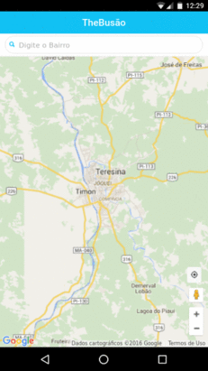

# thebusao
A simple app for location the bus in teresina-pi

## Getting Started

### Installation

First of all, install the dependencies to run this.

- [NodeJS](http://nodejs.org/)
- [Ionic](http://ionicframework.com/)


```sh
# Clone this repository
$ git clone git://github.com/djuniorscjr/thebusao.git thebusao
$ cd thebusao

# install dependencies
$ bower install
$ npm install
$ cordova plugin add cordova-plugin-geolocation

# execute application server
$ ionic serve
```


